# Poductive App #

[Click here to visit the live page.](https://productive-app-ui-80cca270cd7d.herokuapp.com/)

[Click here to visit the Github repository.](https://github.com/TamasSomi/productiveapp-ui)

[Click here to visit the API Github repository.](https://github.com/TamasSomi/productive-app)

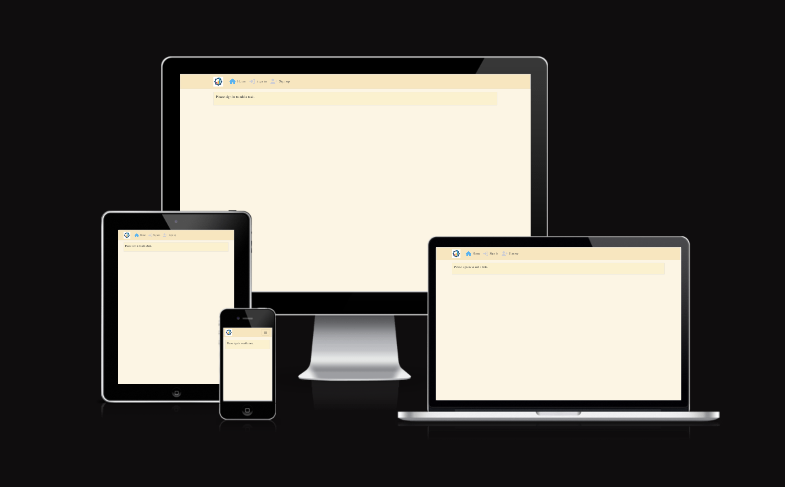

This page is a very simple productivity app where user could create tasks, write notes for the tasks and set deadline, upload img. Built only for learning purposes.

[Click here to read the user stories on Github Issues](/issues)

## Target Audiance ##

* Users working in fast-paced environments who need a straightforward tool to manage their tasks and deadlines.
* Professionals who value simplicity and efficiency in their productivity tools.
* Individuals who want a tool that is easy to use without unnecessary complexities.
* Individuals who enjoy using productivity tools to enhance their personal and professional lives.
* Those who want to keep track of deadlines and make quick notes related to their coursework.
* User who want to add some motivational or other images to there dayli tasks.

## Features ##
(screenshots of the app present in the Testing section)

* User can register.
* Registered user can create tasks.
* User can add notes to the existing tasks.
* User can upload image to the tasks.
* User can set a deadline.
* User can not set the deadline to be in the past.
* User can update the tasks.
* User can delete the tasks.

## Future Features ##

* Fast login with social media.
* More user could access the same task if permitted.
* Assigned responsibilities within a task.

## Security Features ##

* The user is authenticated and can not access any data without logging in.
* Only the owner can read, edit or delete data.
* Unauthorised or not permitted user can not access any task.

## Planning ##

* Implement 2 models on top of profile/user.
* Task for user to create the task, be able to add image, title content and deadline.
* Note related to task model, to add additional note to tasks.

### Sketches ###

* Home page:

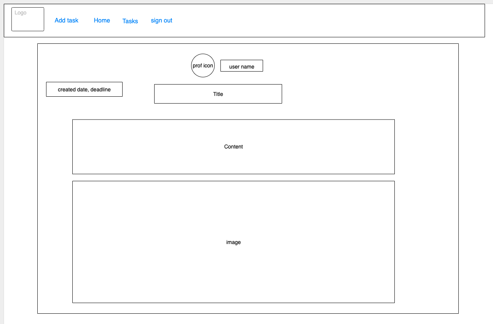

* Task page:

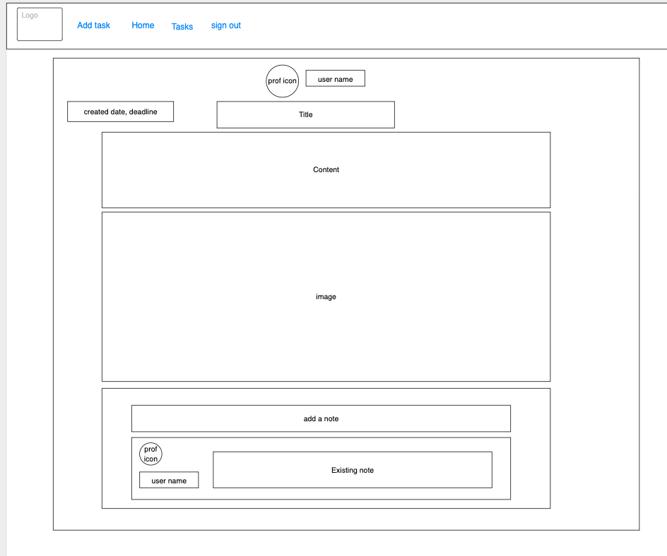

## Authentication ##

### Registration ###

* To register click on the sign up button in the nav bar.
* Fill the form with a valid user name and password.
* Click on sign up under the form.

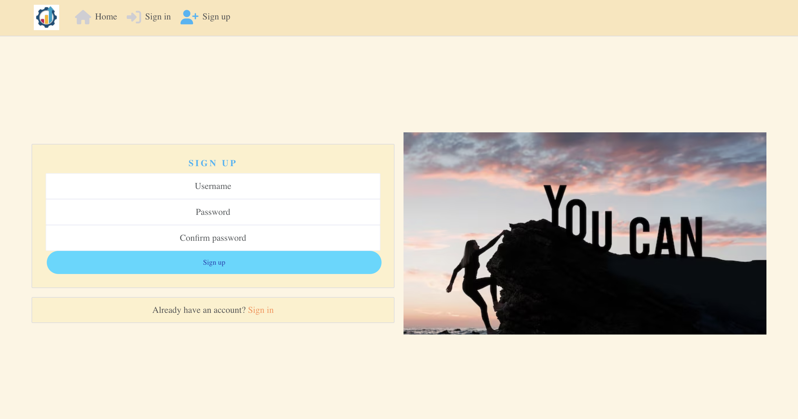

### Sign In ###

* To sign in (after you have a profile created) click on the Sign in button in the nav bar.
* Fill the form with your user name and password.
* Click on sign in button under the form.

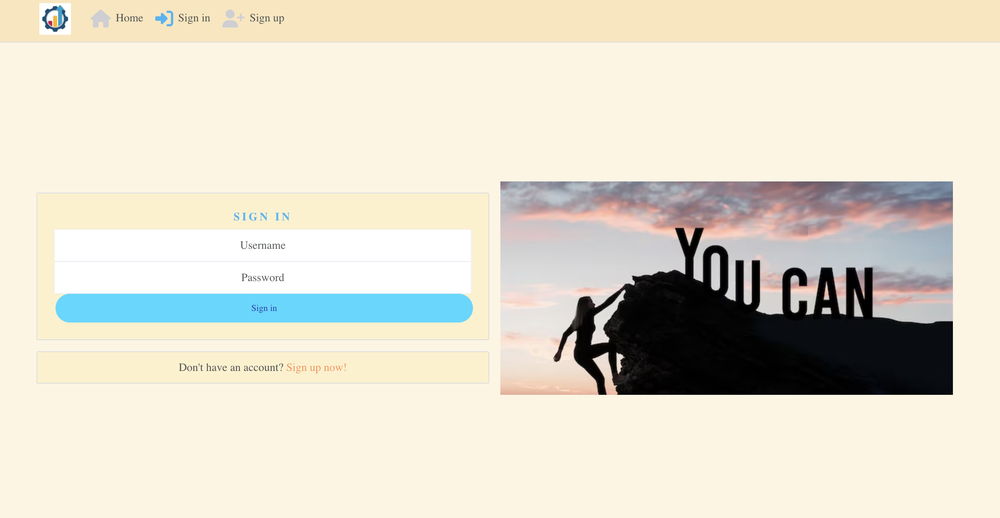

### Sign Out ###

* To sign out, click on the sign out button on the top of the page.

## User interface after logging in ##

### Create a task ###

* To create a task click on the add task button on the top of the page.
* Fill out the form with valid data and click on Create.

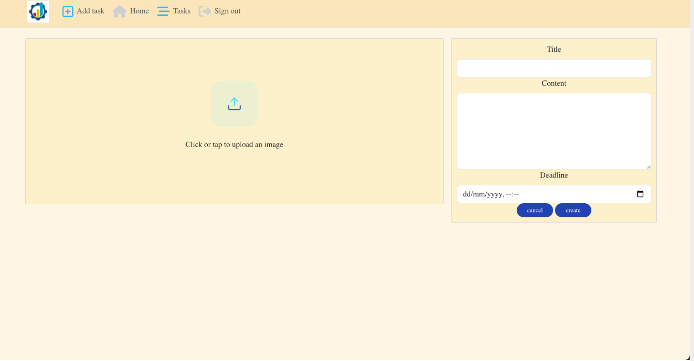

### Edit or delete a task ###

* To edit or delete a task, click on the task from the home page.
* Click the 3 dots on the task.
* To delete the task click on the delete icon.
* To edit a task click on the edit icon and fill the form with the updated data.
* click the save button.

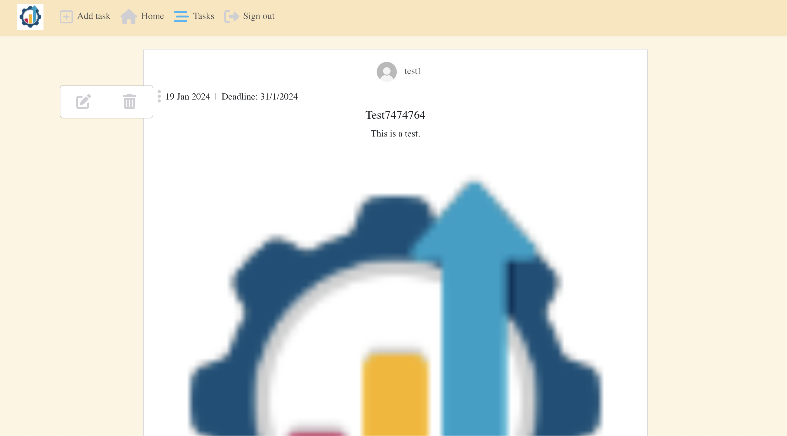

### Create a note ###

* To create a note click on a task you wish to add a note to and under the task, fill the text area with your note.
* Click on the submit button.

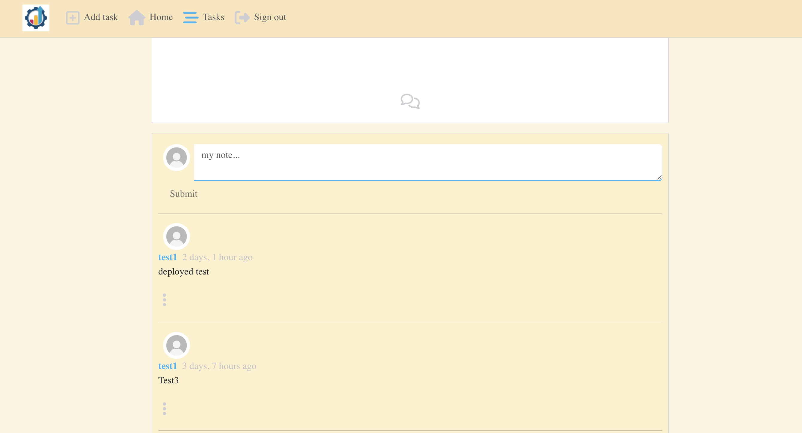

### Edit or delete a note ###

* To delete a note from the home page click on the task. Scroll done to the note and click the three dots.
* Click on the delete icon.
* To edit a note after you clicked the three dots, click on the edit icon.
* Enter the updated note to the text field.
* Click the save button.

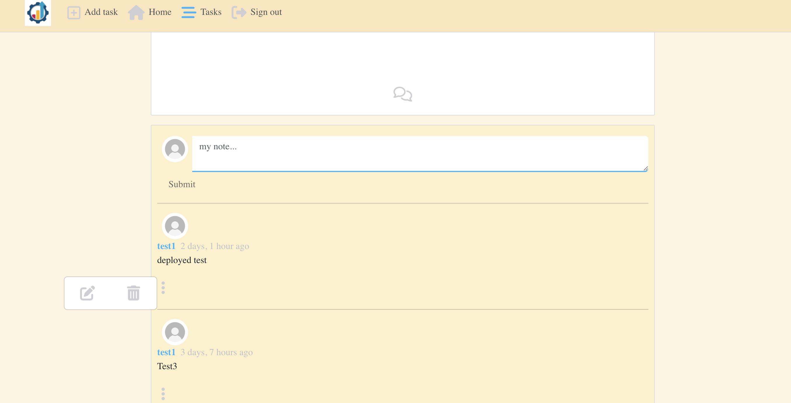

## Technology Used ##

Used technologies during development:

* [Github](https://github.com/)
* [Codeanywhere](https://codeanywhere.com/)
* [Heroku](https://dashboard.heroku.com/)
* [Django Allauth](https://docs.allauth.org/en/latest/#)
* [ElephantSql](https://www.elephantsql.com/)
* [Moqups](https://moqups.com/)
* [LightHouse](https://developer.chrome.com/docs/lighthouse/overview)
* [Cloudinary](https://cloudinary.com/)
* [Favicon](https://favicon.io/)
* 

### Languages/Frameworks Used ###

* [HTML5](https://developer.mozilla.org/en-US/docs/Glossary/HTML5)
* [CSS3](https://developer.mozilla.org/en-US/docs/Web/CSS)
* [JavaScript](https://developer.mozilla.org/en-US/docs/Web/JavaScript)
* [ReactJS](https://react.dev/)
* [React-Bootstrap](https://react-bootstrap.netlify.app/)
* [Django-Rest](https://www.django-rest-framework.org/)

## Manual Test ##

### Test Case: Registration ###

#### Steps: ####
1. Navigate to the registration page.
2. Fill in all required fields with valid data.
3. Click the register button.

#### Expected Results: ####
1. The registration page is displayed.
2. All fields accept valid input.
3. The user is redirected to the homepage.

#### Result: ####
1. Pass.
2. Pass.
3. Pass.

### Test Case: Login ###

#### Steps: ####
1. When logged out, click on the Sign In button.
2. Fill in the fields with an existing username and password.
3. Press the Sign in button.

#### Expected Results: ####
1. The login page is displayed.
2. All fields accept valid input.
3. The user is redirected to the home page.

#### Result: ####
1. Pass.
2. Pass.
3. Pass.

### Test Case: Logout ###

#### Steps: ####
1. When logged in, click on the Sign Out button.

#### Expected Results: ####
1. The home page is displayed. User is logged out.

#### Result: ####
1. Pass.

### Test Case: Create a Task ###

#### Steps: ####
1. Go to the add a task page when signed in by clicking on the add task button.
2. Fill the task form with valid data.
3. Press the create button.

#### Expected Results: ####
1. User redirected to the create task page and the form displayed with fields of title, content, and deadline, add image fields.
2. The form accepts only valid data. All fields required.
3. The user is redirected to the home/tasks page. The new task is displayed on top of home/tasks page.

#### Result: ####
1. Pass.
2. Pass.
3. Pass.

### Test Case: Edit a Task ###

#### Steps: ####
1. Go to the dashboard by clicking on the home or tasks button.
2. Click on one of your tasks and on the three dots, click the edit icon.
3. Change the data.
4. Press the save button.

#### Expected Results: ####
1. The existing tasks are displayed on the home/tasks page.
2. The user is redirected to the edit_task page. A form displayed with fields of name, title, content, deadline, and add image.
3. The user is able to change the desired field with valid data.
4. The user is redirected to the dashboard, and the task is displayed with the updated data.

#### Result: ####
1. Pass.
2. Pass.
3. Pass.
4. Pass.

### Test Case: Delete a Task ###

#### Steps: ####
1. Go to the home page by clicking on the tasks/home button. Click on a task.
2. Click the three dots, delete icon on the task.

#### Expected Results: ####
1. The tasks are displayed on the page.
2. The user is redirected to the home page. The deleted task is not displayed anymore.

#### Result: ####
1. Pass.
2. Pass.

### Test Case: Responsiveness Test ###

#### Steps: ####
1. Access the website with a desktop computer.
2. Open up the devtool and set all the available devices.
3. Verify that all content and features are properly displayed and usable on all devices.

#### Expected Results: ####
1. The website is fully displayed with all content and features accessible and usable.
2. All elements function as expected on both desktop and mobile versions.

#### Result: ####
1. Pass.
2. Pass.

### Test Case: Reading a Task ###

#### Steps: ####
1. Go to the home page by clicking on the home/tasks button.

#### Expected Results: ####
1. The already existing tasks are displayed with all the necessary data.

#### Result: ####
1. Pass.

### Test Case: Add a Note to a Task ###

#### Steps: ####
1. Go to the home menu by clicking on the tasks/home button.
2. Click on the task you want to add a note for.
3. Scroll down and under the task enter the text you want to add.
4. Press the submit button.

#### Expected Results: ####
1. The tasks are displayed.
2. The selected task displayed.
3. User can see the textfield for the note.
4. The note added to the selected task.

#### Result: ####
1. Pass.
2. Pass.
3. Pass.
4. Pass.

### Test Case: Edit a Note ###

#### Steps: #####
1. Go to the home menu by clicking on the tasks/home button.
2. Click on the task that the note you want to edit is related to.
3. Scroll down and under the task on the note, click on the three dots, edit button.
4. Change the note.
5. Press the save button.

#### Expected Results: ####
1. The tasks are displayed.
2. The selected task displayed.
3. User can see the note and when clicked, redirected to the editNote page.
4. User can change the content of the textfield.
5. User is redirected to the task page, the updated note is displayed.

#### Result: ####
1. Pass.
2. Pass.
3. Pass.
4. Pass.
5. Pass.

### Delete a note ###

#### Steps: #####
1. Go to the home menu by clicking on the tasks/home button.
2. Click on the task that the note you want to delet is related to.
3. Scroll down and under the task on the note, click on the three dots, delete button.

#### Expected Results: ####
1. The tasks are displayed.
2. The selected task displayed.
3. User can see the note and when deleted, redirected to the task page.

#### Result: ####
1. Pass.
2. Pass.
3. Pass.

## Online tets, code cheker results ##

* Lighthouse test:

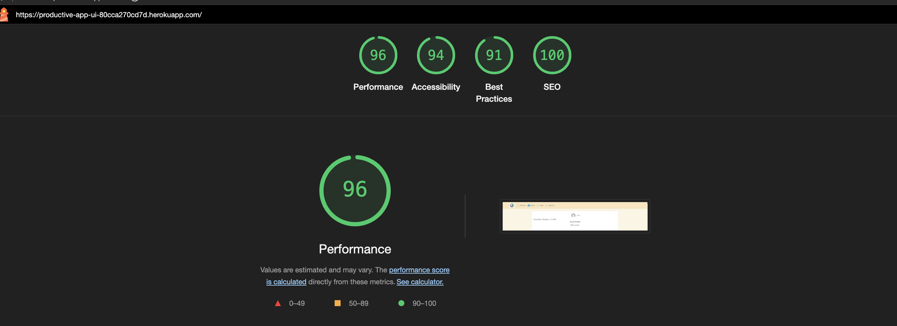

* No errors were returned after runing Eslint tests.
* Eslint was set up with the following rules:

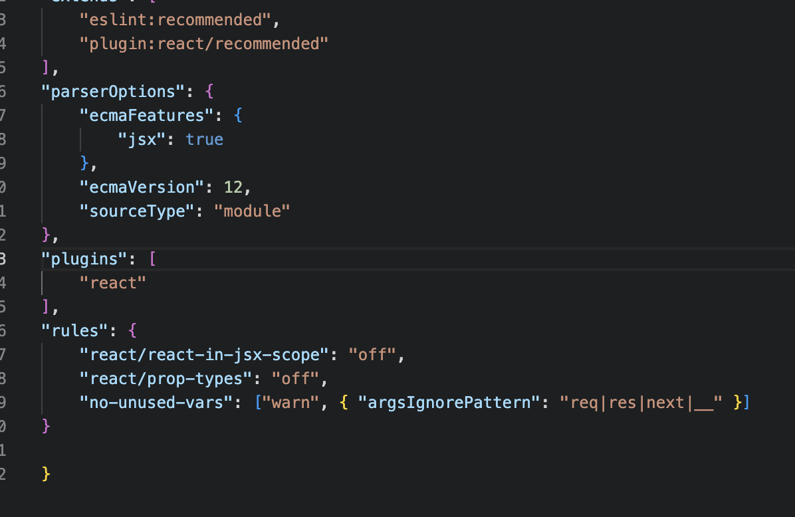

## Bugs ##

### User could set the deadline in the future ###
* Solved by adding validate_deadline method and raise an error.

### A note was assined for all the tasks ###
* Solved by parseing the note id and than map.

### When clicked on a task while loading, not permitted message was displayed. ###
* Solved by checking if loaded and added the spinner to TaskPage as well.

### Remaining Bugs ###
* The note count is not displaying the number of notes.

## Deployment ##

### Deployment to Heroku ###

* After you have created a new gitpod/codeanywhere workspace and set up the new project, you can deploy to Heroku.

* In your heroku account, select Create New App, and give it a unique name related to your project.
* Select a region corresponding to where you live and click 'Create App'.
* Go into the 'Deploy' tab select GitHub as the 'deployment method', find your project repository and click 'Connect'.
* lick 'Deploy branch' to trigger Heroku to start building the application.
* When you see the message saying 'build succeeded' you can click 'Open App' to see your application in the browser.

### Fork this Project Repository ###

It is possible to make an independent copy of a GitHub Repository by forking the GitHub account. The copy can then be viewed and it is also possible to make changes in the copy without affecting the original repository. To fork the repository, follow these steps:

 * Log in to GitHub
 * Locate the repository. On the top right side of the page there is a 'Fork' button. Click on the button to create a copy of the original repository.

### Clone this Project Repository ###

A Git clone creates a linked copy of the project that will continue to synchronize with the original repository. In order to create a clone, you can click on the 'Code' button inside the selected repository and then select the 'Clone' option from the dropdown list.

## Credit ##

* The image on the sign in and sign up page was taken from Google images.
* The No Results found image is taken from Code Institute Moments Walktrough resources.
* I used [this article](https://stackoverflow.com/questions/28061550/model-datetime-field-validation-for-fields-with-auto-now) to validate the deadline input.
* I used Code Institute's Moments walktrough project as an example during development.
* I used a color palette from [color-hex](https://www.color-hex.com/color-palette/4611).

